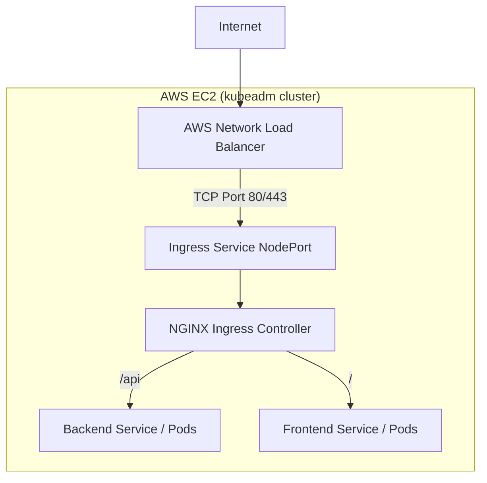

# Future Plan: AWS Deployment on kubeadm (NLB + NGINX Ingress)

This document outlines the architectural plan for deploying the **Full Stack Realtime Chat App** on a self-managed Kubernetes cluster (built with `kubeadm`) running on AWS EC2 instances. 

The goal is to use an **AWS Network Load Balancer (NLB)** that routes L4 traffic directly to the **NGINX Ingress Controller** running on your worker nodes. The Ingress Controller then handles all L7 routing (HTTP/WebSocket) to the backend and frontend pods.

## 1. Architecture Overview



## 2. Setting up the AWS NLB

Since you are running a custom `kubeadm` cluster (not EKS), you have two main approaches to connect an AWS NLB to your cluster:

### Approach A: AWS Cloud Controller Manager (Recommended)
If your `kubeadm` cluster is integrated with the `aws-cloud-controller-manager`, Kubernetes can natively talk to AWS APIs.
1. Deploy the NGINX Ingress Controller Service as `type: LoadBalancer`.
2. Add the AWS NLB annotations to the service (similar to EKS):
   ```yaml
   annotations:
     service.beta.kubernetes.io/aws-load-balancer-type: "nlb"
   ```
3. The Cloud Controller Manager will automatically provision an AWS NLB and map its Target Groups to your EC2 instances' NodePorts.

### Approach B: Manual NLB Provisioning
If your `kubeadm` cluster does not have AWS Cloud Provider integration:
1. Deploy the NGINX Ingress Controller Service as `type: NodePort` (e.g., exposing port `32080` for HTTP and `32443` for HTTPS).
2. Go to the AWS Console (EC2 -> Load Balancers).
3. Create a **Network Load Balancer (NLB)**.
4. Create Target Groups (Type: Instance) pointing to the specific `NodePort` numbers (e.g., `32080` and `32443`) of your EC2 worker nodes.
5. Configure the NLB listeners (Port 80/443) to forward to these Target Groups.

## 3. Ingress Resource (`k8s/chat-ingress.yml`)

Because the NGINX Ingress Controller handles all the heavy lifting, your application's `chat-ingress.yml` requires **zero changes** to its routing logic. 

If you are using TLS, you can either:
1. Terminate TLS at the AWS NLB (by attaching an ACM certificate to the NLB listener).
2. Terminate TLS at the NGINX Ingress Controller (using `cert-manager` and Let's Encrypt). Since NLB passes TCP directly, terminating at the Ingress is very common for `kubeadm` clusters.

## 4. Storage Class for MongoDB

You mentioned in previous phases that you have **Longhorn** installed on your cluster. 
Since Longhorn handles distributed block storage seamlessly by utilizing the attached storage of your EC2 nodes, **no changes are needed for the storage class**. 

You will continue to use:
```yaml
storageClassName: longhorn
```
This avoids the need to install the AWS EBS CSI driver and keeps your storage layer cloud-agnostic.

## 5. Socket.IO & WebSocket Considerations

The AWS NLB is a Layer 4 load balancer, meaning it passes TCP traffic flawlessly. This is perfect for WebSockets. The NGINX Ingress Controller on your EC2 instances will intercept the HTTP Upgrade requests and maintain the persistent WebSocket connections to your `backend` pods. 

Because we have implemented Redis-backed Socket.IO, horizontal pod autoscaling (HPA) across your EC2 instances will work seamlessly. Users connected to a backend pod on Node A can chat instantly with users on Node B.
